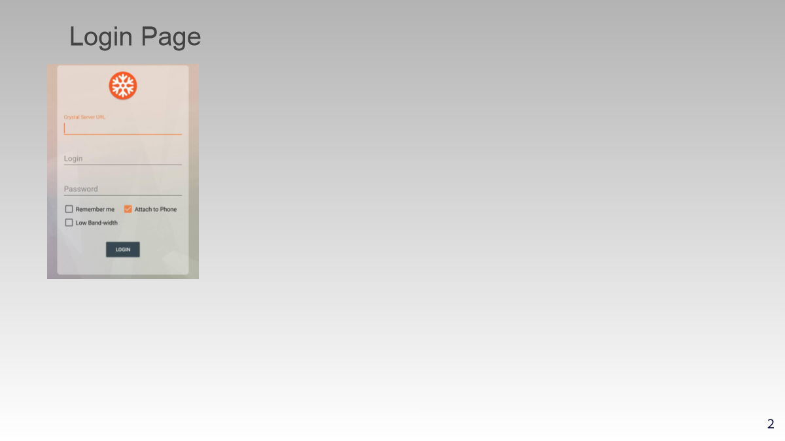

<!-- # How to Login

Follow these steps to log in to the app.

<b>Step 1: Open the App</b>  
Open the app by tapping on the icon on your home screen.Once the app is open. 

<b>Step 2: Enter Your Credentials</b>  
Enter your username and password to log in.

<b>Step 3: Tap the Login Button</b>  
Press the "Login" button to proceed.

 -->

<!-- filepath: /root/crystalemr/docs/Training/login.md -->
# How to Login

Follow these steps to log in to the app.

<b>Step 1: Open the App</b>  
Open the app by tapping on the icon on your home screen.Once the app is open. 

<b>Step 2: Enter Your Credentials</b>  
Enter your username and password to log in.

<b>Step 3: Tap the Login Button</b>  
Press the "Login" button to proceed.

